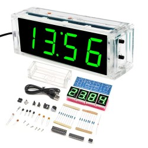

# DIY LED Clock Firmware - CAI-082-V4

Firmware optimizado para relojes LED DIY basados en microcontroladores STC15, específicamente adaptado para el modelo **CAI-082-V4** con migración de STC15W408AS a **AP15W413AS**.



---

## Hardware

### Especificaciones

**Modelo del Reloj:** CAI-082-V4  
**Microcontrolador Original:** STC15W408AS-35I-SKDIP28 (8KB Flash)  
**Microcontrolador Actualizado:** AP15W413AS-35I-SKDIP28 (13KB Flash)  

### Componentes Principales

- **MCU:** AP15W413AS (8051 enhanced, 1T architecture)
  - Flash: 13KB
  - RAM: 512B (256B scratch-pad + 256B auxiliary)
  - EEPROM/IAP: ~5KB
  - Voltaje: 2.4-5.5V
  - Frecuencia: 0-35MHz (configurable RC interno)

- **RTC:** DS1302
  - Reloj en tiempo real con batería de respaldo
  - 31 bytes BBSRAM (Battery-Backed SRAM)
  - Almacena: hora, fecha, alarmas, configuración

- **Display:** 4 dígitos LED 7-segmentos
  - Multiplexado vía PCA
  - Brillo ajustable automático/manual
  - Common anode

- **Sensores:**
  - LDR (Light Dependent Resistor) - sensor de luz ambiental
  - Termistor NTC - sensor de temperatura

- **Controles:** 2 botones (MENU y SELECT)

- **Audio:** Buzzer piezoeléctrico (alarmas)

---

## Funcionamiento del Reloj

### Botones

**BUTTON_MENU** (superior):
- **Corto** (< 320ms): Cambiar pantalla / Navegar opciones
- **Largo** (320ms-1.5s): Guardar / Volver

**BUTTON_SELECT** (inferior):
- **Corto** (< 320ms): Toggle función / Incrementar valor
- **Mantenido** (≥ 1.5s): Auto-incremento rápido (solo TCAL)

**MENU + SELECT largo** (ambos 1.5s): Entrar a configuración

---

### Pantallas (Modo HOME)

El reloj cicla automáticamente entre las pantallas habilitadas:

1. **HH:MM** (Time) - Hora principal con colon parpadeando
2. **MM:SS** (Minutes:Seconds) - Minutos y segundos
3. **TEMP** - Temperatura en °C
4. **DOW** (Day of Week) - Día de la semana (MON, TUE, etc.)
5. **DATE** - Fecha (DD-MM o MM-DD según configuración)
6. **YYYY** - Año (20XX)
7. **ALARM** - Estado de alarmas (cuando suena)

**Navegación:**
- MENU corto: Siguiente pantalla
- SELECT corto: Toggle brillo automático/manual
- Timeout 5s: Vuelve automáticamente a HH:MM
- Auto-scroll: Tras 10s inactivo en HH:MM, cicla pantallas cada 2s

---

### Menú de Configuración (CONFIG)

**Entrar:** MENU + SELECT largo desde HOME

#### Opciones Disponibles:

**1. LCAL (Light Calibration)**
- Calibrar sensor LDR para brillo automático
- Procedimiento:
  1. SELECT largo → entra
  2. "CLLO" → Tapar sensor (oscuridad) → SELECT
  3. "CLHI" → Iluminar sensor (luz directa) → SELECT
  4. Genera tabla automáticamente
  5. MENU largo → guarda y sale

**2. TCAL (Temperature Calibration)**
- Ajustar offset de temperatura (±14.0°C en pasos de 0.1°C)
- Procedimiento:
  1. SELECT largo → entra
  2. SELECT corto → incrementa +0.1°C
  3. SELECT mantenido → auto-incremento rápido
  4. MENU largo → guarda y sale

**3. DISP (Display Options)**
- Configurar pantallas y formato
- Opciones:
  - **MS**: Auto-scroll MM:SS (ON/OFF)
  - **TP**: Auto-scroll Temperatura (ON/OFF)
  - **DW**: Auto-scroll Day of Week (ON/OFF)
  - **DT**: Auto-scroll Date (ON/OFF)
  - **YR**: Auto-scroll Year (ON/OFF)
  - **12**: Formato 12h/24h
  - **MD**: Formato fecha MM/DD vs DD/MM
  - **LZ**: Ceros a la izquierda (ON/OFF)
- Navegación:
  - MENU corto → siguiente opción
  - SELECT corto → toggle ON/OFF
  - MENU largo → vuelve a DISP label

**Salir de CONFIG:** MENU corto en label "CONF"

---

### Ajuste de Hora (SET)

**Entrar:** MENU + SELECT largo desde CONFIG (mostrar "SETC")

**Campos editables:**
1. **HH** - Horas (00-23 o 01-12)
2. **MM** - Minutos (00-59)
3. **DD** - Día (01-31)
4. **MONTH** - Mes (01-12)
5. **YYYY** - Año (2026-2099)
6. **DOW** - Día semana (MON-SUN)

**Navegación:**
- SELECT corto → incrementa valor
- MENU corto → siguiente campo
- MENU largo → guarda y sale

---

### Alarmas (ALARM)

**Entrar:** Navegar hasta pantalla ALARM en HOME → MENU + SELECT largo

#### Nivel 1 - Lista de Alarmas:
- **ALON/ALOF** - Toggle global de alarmas
- **Alarm 0-6** - 7 alarmas independientes

**SELECT largo** en una alarma → entra a configuración

#### Nivel 2 - Configuración Individual:
- **Toggle ON/OFF** - Activar/desactivar alarma
- **HH** - Hora (00-23)
- **MM** - Minuto (00-59)
- **MON-SUN** - Días de la semana (ON/OFF individual)

**MENU largo** → guarda en DS1302 BBSRAM

#### Cuando Suena una Alarma:
- Buzzer activo (patrón ~1Hz)
- Display parpadeando
- **Apagar:** MENU + SELECT largo

---

## Arquitectura del Firmware

### Estructura de Archivos

```
DIY_clock/
├── src/                    # Código fuente
│   ├── main.c             # Inicialización y bucle principal
│   ├── fsm.c              # Máquina de estados (HOME, SET, ALARM, CONFIG)
│   ├── ds1302.c           # Driver RTC + BBSRAM
│   ├── display.c          # Control display LED multiplexado
│   ├── button.c           # Debounce y detección de pulsaciones
│   ├── timer.c            # ISR Timer0 (10ms timebase)
│   ├── adc.c              # Conversión ADC (LDR + termistor)
│   ├── alarm.c            # Control buzzer y alarmas
│   ├── eeprom.c           # Tablas Flash (IAP)
│   ├── ledfonts.c         # Fuentes 7-segmentos
│   ├── crc.c              # CRC-CCITT para BBSRAM
│   └── uart.c             # Debug serial (opcional)
├── include/               # Headers
├── Release/               # Archivos objeto (.rel) autogenerados
├── Binary/                # Firmware compilado (.ihx)
├── Makefile               # Sistema de compilación
├── check_size.sh          # Script verificación tamaño
└── README.md              # Esta documentación
```

### Capas de Software

```
┌─────────────────────────────────────┐
│    Aplicación (FSM)                 │
│  main.c, fsm.c                      │
├─────────────────────────────────────┤
│    HAL (Hardware Abstraction)       │
│  stc15w408as.h, board_config.h      │
├─────────────────────────────────────┤
│    Periféricos (Drivers)            │
│  ds1302, display, button, adc, etc. │
└─────────────────────────────────────┘
```

### Sistema de Interrupciones

**4 ISRs activas:**

1. **ISR_PCA** (prioridad alta) - ~1kHz
   - Multiplexeo display 7-segmentos
   - Control brillo (duty cycle)
   - Flash para alarmas

2. **ISR_T0** (Timer0) - 100Hz (cada 10ms)
   - Timebase del sistema
   - Debounce botones
   - Trigger conversiones ADC
   - Detección pulsación larga/mantenida

3. **ISR_ADC** - On conversion complete
   - Lee termistor o LDR (alternado)
   - Actualiza brillo display con filtro exponencial
   - Indexa tabla EEPROM para mapeo ADC→PWM

4. **ISR_T2** (Timer2) - ~30Hz (solo con alarma)
   - Genera tono buzzer (8 ciclos on, 8 off)
   - Auto-apaga tras 5 minutos

### Mapa de Memoria

Ver documentación detallada en `Binary/Memory_Allocation.pdf`

**Resumen:**
- **IRAM (0x00-0xFF):** Registros, flags, stack
- **XRAM (0x00-0xFF):** Cache DS1302, buffers
- **Flash EEPROM (0x2000+):** Tablas LDR y temperatura
- **DS1302 BBSRAM (31 bytes):** Configuración persistente

**Tablas principales:**
- `0x2000-0x27FF`: LDR→PWM lookup (1024×2 bytes)
- `0x2800-0x2FFF`: Thermistor→Temp lookup (1024×2 bytes)
- `0x3000-0x30FE`: Fuentes 7-segmentos
- `0x3250-0x3273`: Conversión 24h→12h (reubicada)

---

## Compilación

### Requisitos

- **SDCC** (Small Device C Compiler) 4.x
- **Make**
- **Python 3** (para check_size.sh con bc)

```bash
# Ubuntu/Debian
sudo apt-get install sdcc make python3

# Verificar instalación
sdcc --version
```

### Compilar Firmware

```bash
# Limpiar y compilar
make clean
make

# Ver tamaño del binario
make size

# Salida esperada:
# Código: ~7880 bytes (7.7 KB) ✓ Cabe en AP15W413AS
# EEPROM: ~4096 bytes (tablas)
```

### Estructura de Compilación

```bash
# Proceso de compilación:
src/*.c → (SDCC) → Release/*.rel → (Linker) → Binary/DIY_Firmware_13k.ihx

# Archivos generados en Release/:
# *.rel  - Archivos objeto relocalizables
# *.lst  - Listings de ensamblador
# *.sym  - Tabla de símbolos
# *.map  - Mapa de memoria

# Archivo final en Binary/:
# DIY_Firmware_13k.ihx - Firmware en formato Intel HEX
```

---

## Flasheo

### Hardware Necesario

- **Adaptador USB-Serial** (CH340/CH341, CP2102, FTDI, etc.)
- **Cables Dupont** (4 pines)
- **Fuente 5V** (puede ser del USB-Serial si entrega suficiente corriente)

### Conexiones

```
USB-Serial         Reloj CAI-082-V4
──────────         ────────────────
TXD           →    RXD (P3.0)
RXD           →    TXD (P3.1)
GND           →    GND
VCC (5V)      →    VCC (solo si no hay otra alimentación)
```

** IMPORTANTE:**
- **CRUZAR** TX/RX (TX del adaptador va a RX del reloj)
- **NO conectar VCC** si el reloj ya tiene alimentación externa
- Configurar jumper del USB-Serial a **5V**

### Software de Flasheo

#### Instalar stcgal

```bash
# Instalar stcgal
sudo pip3 install stcgal

# Verificar
stcgal --help
```

#### Flashear

```bash
# Dar permisos al puerto (una vez por sesión)
sudo chmod 666 /dev/ttyACM0

# Método automático desde Makefile
make flash

# O manual:
stcgal -P stc15 -p /dev/ttyACM0 -t 22118.4 \
       -o eeprom_erase_enabled=True \
       Binary/DIY_Firmware_13k.ihx
```

#### Secuencia de Flasheo

```
1. Ejecutar comando stcgal
2. Cuando muestre "Waiting for MCU..."
3. Ciclar alimentación del reloj (desconectar y reconectar VCC)
4. stcgal detectará el chip automáticamente
5. Flasheo tomará ~5 segundos
6. "Disconnected!" = ¡Éxito!
```

### Primer Arranque

Después de flashear:

```bash
# 1. Presionar AMBOS botones simultáneamente al conectar alimentación
#    Esto fuerza ds1302_power_loss_reset()
#    - Resetea RTC a valores por defecto
#    - Limpia BBSRAM
#    - Recalcula CRC
#    - Inicializa configuración

# 2. Verificar funcionamiento:
#    - Display muestra HH:MM con colon parpadeando
#    - Buzzer pita 2 segundos al inicio (normal)

# 3. Calibrar brillo automático:
#    MENU + SELECT largo → CONFIG → LCAL
#    - CLLO: tapar sensor → SELECT
#    - CLHI: iluminar sensor → SELECT
#    - MENU largo para guardar
```

---

## Migración STC15W408AS → AP15W413AS

### Compatibilidad Hardware

| Característica | STC15W408AS | AP15W413AS | Estado |
|----------------|-------------|------------|--------|
| Arquitectura | 8051 1T | 8051 1T | ✅ Idéntico |
| Pinout | SKDIP28 | SKDIP28 | ✅ Compatible |
| Flash | 8KB | 13KB | ✅ Upgrade |
| RAM | 512B | 512B | ✅ Idéntico |
| EEPROM | ~5KB | ~5KB | ✅ Compatible |
| Voltaje | 2.4-5.5V | 2.4-5.5V | ✅ Idéntico |
| SFRs | Estándar | Estándar | ✅ Compatible |

---

## Referencias

### Datasheets

- [STC15W4xxAS Series (Chino)](http://www.stcmicro.com/datasheet/STC15W408AS_Features.pdf)
- [DS1302 RTC](https://www.analog.com/media/en/technical-documentation/data-sheets/DS1302.pdf)
- [SDCC User Manual](http://sdcc.sourceforge.net/doc/sdccman.pdf)

### Herramientas

- [SDCC Compiler](http://sdcc.sourceforge.net/)
- [stcgal Programmer](https://github.com/grigorig/stcgal)

### Proyecto Original

- **Fork basado en:** [https://github.com/shenghaoyang/stc_led_clock_8k]
- **Autor original:** shenghao
- **Licencia:** Ver LICENSE file

---

## Contribuciones

Este es un fork con mejoras específicas para hardware CAI-082-V4 con AP15W413AS.

### Cambios Principales de Este Fork

- ✅ Corrección de 6 bugs críticos
- ✅ Migración a AP15W413AS (13KB)
- ✅ Mejoras de usabilidad (timeouts optimizados)
- ✅ Sistema de compilación limpio (Makefile)
- ✅ Documentación completa en español

### Reportar Problemas

Si encuentras bugs o tienes sugerencias:
1. Verifica que usas hardware compatible (CAI-082-V4)
2. Comprueba versión del firmware (año base 2026)
3. Abre un issue con detalles completos

---

## Licencia

Ver archivo `LICENSE` para términos completos.

Este fork mantiene la licencia del proyecto original.

---

## Agradecimientos

- **Autor original:** shenghao - Por el firmware base.

---
